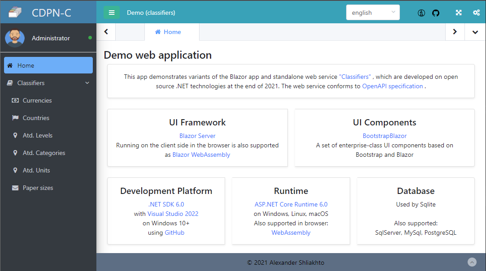

Language: [English](README.md) | [Русский](README.ru.md) | [Українська](README.uk.md)

# CDPN Classifiers

## General information 

General classifiers for the complex CDPN:

- Currencies according to ISO 4217
- Countries according to ISO 3166-1
- ATD levels
- ATD categories
- ATD units (levels 0 and 1)
- Sizes of paper and envelopes according to ISO 216 и ISO 269

Classifier data in Ukrainian.

ATD - administrative-territorial divisions

## Demo

- [Classifiers API](https://classifiers-api.infdev.com.ua/swagger/)
- [Classifiers UI. Server hosting](https://classifiers-ui.infdev.com.ua/)
- [Classifiers UI WASM. Client (browser) hosting](https://classifiers-ui-wasm.infdev.com.ua/)

