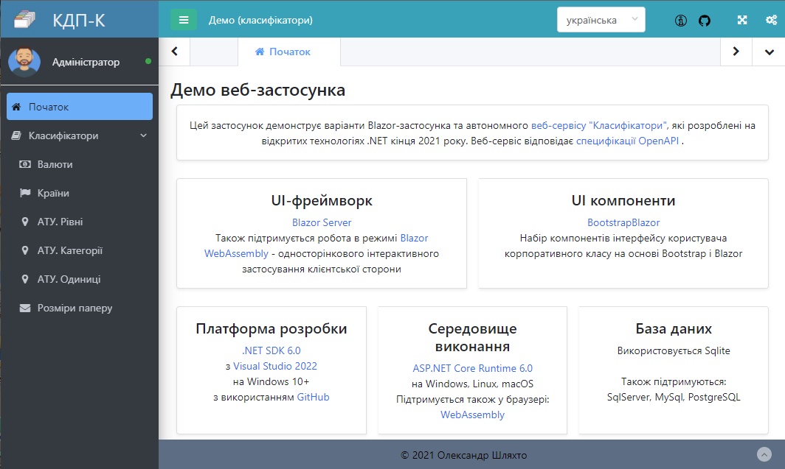

Мова: [English](README.md) | [Русский](README.ru.md) | [Українська](README.uk.md)

# КДП-К. Класифікатори

## Загальні відомості 

Загальні класифікатори для комплексу КДП-К:

- Валюти згідно ISO 4217
- Країни згідно ISO 3166-1
- Рівні АТУ
- Категорії АТУ
- Одиниці АТУ (рівні 0 та 1)
- Розміри паперу та конвертів відповідно до ISO 216 та ISO 269

Дані класифікаторів українською мовою.

АТУ - адміністративно-територіальний устрій

## Демо

- [Classifiers API](https://classifiers-api.infdev.com.ua/swagger/)
- [Classifiers UI. Розміщення на сервері](https://classifiers-ui.infdev.com.ua/)
- [Classifiers UI WASM. Розміщення на клієнті](https://classifiers-ui-wasm.infdev.com.ua/)

